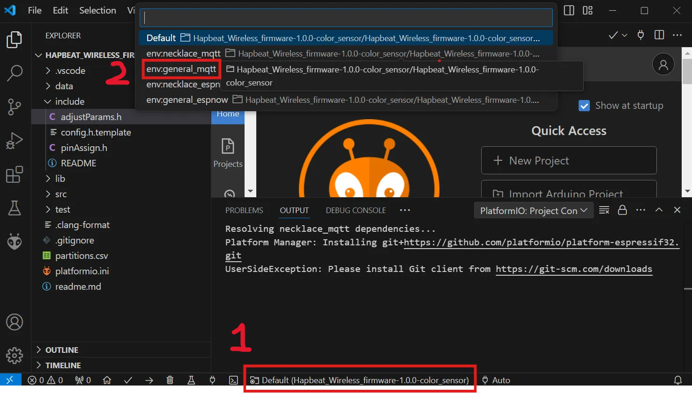

# Hapbeat Wireless Sender Firmware

Hapbeat Wireless Sender Firmware は、M5Stack シリーズを無線送信機として利用し、Hapbeat Wireless と通信するためのファームウェアです。

## Quick Start（M5Stack basic & esp-now の場合）

※ 事前に git, VSCode をインストールし、VSCode の拡張機能から platform io をインストールしてください。

1. リポジトリのクローン or zip ファイルダウンロード
2. 各 M5Stack に合わせた USB ドライバのインストール [USB Driver & Open source Library](https://docs.m5stack.com/en/download)
3. M5Stack を PC に接続し、認識されているか確認（デバイスマネージャーで不明なデバイスと表示されなければ OK）  
   
4. VSCode の下部（画像赤枠）env:M5Stack_basic-ESPNOW を選択しビルド&書き込み
   
5. Hapbeat Wireless の電源を ON にし、カテゴリを 0 に合わせ、ボタン押下で動作するか確認

## 必要な環境

**対応ハードウェア**:

推奨：USB 変換チップ搭載の M5 シリーズ（主に S3 以外）

- M5Stack basic（ボタン付きの M5Stack）
- ATOM Lite
- M5Stamp C3
- M5stick C

可能：S3 シリーズ

- M5Stack CoreS3
- M5Stamp S3
- M5Capsule

※S3 シリーズの場合、送信頻度が多い（数ミリ秒程度の送信間インターバル）と動作不良を起こす可能性が高く不安定です。使用自体は可能ですが、USB 変換チップを搭載したシリーズをおすすめします。

**ソフトウェア**:

- Windows OS（Mac でも動作するとは思いますがサポート対象外です）
- [PlatformIO](https://platformio.org/) IDE

## 書き込み時の env 説明

`デバイス名 - 通信方式 - アプリケーション`のように、ハイフン区切りで意味が分かれています。

### 通信方式

- ESPNOW: 低遅延（数ミリ秒）・ブロードキャスト通信。送信機と受信機を直接接続（安定するのは 30m 程度）
- MQTT: Wi-Fi 接続および MQTT プロトコルを利用する方式。Wi-Fi の範囲内で遠距離通信可能だが、別途 MQTT ブローカーの用意が必要（インターネット経由）。
  - MQTT_local: ローカルの MQTT ブローカーを使用する場合。

### アプリケーション

- Color: カラーセンサーの値によって振動通知を送信。現状 MQTT のみ対応。

## パラメータ調整項目

### espnow

`src/adjustmentParams.cpp`

- data_BtnA,B,C M5Stack Basic 利用時に、ボタン押下時に送信するデータを修正可能（左から A,B,C）

---

---

### 使用ライブラリとライセンス情報

このプロジェクトで使用している外部ライブラリと、そのライセンス情報は以下の通りです。各ライブラリの詳細なライセンス内容は、`licenses/` フォルダ内のファイルを参照してください。

| ライブラリ名      | バージョン | ライセンス     | ライセンスファイル名                                                                |
| ----------------- | ---------- | -------------- | ----------------------------------------------------------------------------------- |
| M5Unified         | 0.1.14     | MIT ライセンス | [M5Unified_0.1.14_LICENSE.md](./licenses/M5Unified_0.1.14_LICENSE.md)               |
| Adafruit TCS34725 | 1.4.4      | BSD ライセンス | [Adafruit_TCS34725_1.4.4_LICENSE.md](./licenses/Adafruit_TCS34725_1.4.4_LICENSE.md) |
| MQTT (256dpi)     | 2.5.2      | MIT ライセンス | [MQTT_2.5.2_LICENSE.md](./licenses/MQTT_2.5.2_LICENSE.md)                           |
| PubSubClient      | 2.8        | MIT ライセンス | [PubSubClient_2.8_LICENSE.md](./licenses/PubSubClient_2.8_LICENSE.md)               |
| ArduinoJson       | 7.1.0      | MIT ライセンス | [ArduinoJson_7.1.0_LICENSE.md](./licenses/ArduinoJson_7.1.0_LICENSE.md)             |
| FastLED           | 3.7.0      | MIT ライセンス | [FastLED_3.7.0_LICENSE.md](./licenses/FastLED_3.7.0_LICENSE.md)                     |

---

### 注意事項

- 各ライブラリのライセンス条件に従い、本プロジェクトを利用してください。
- このフォルダ内のライセンスファイルは、それぞれのライブラリの公式リポジトリから取得したものです。
